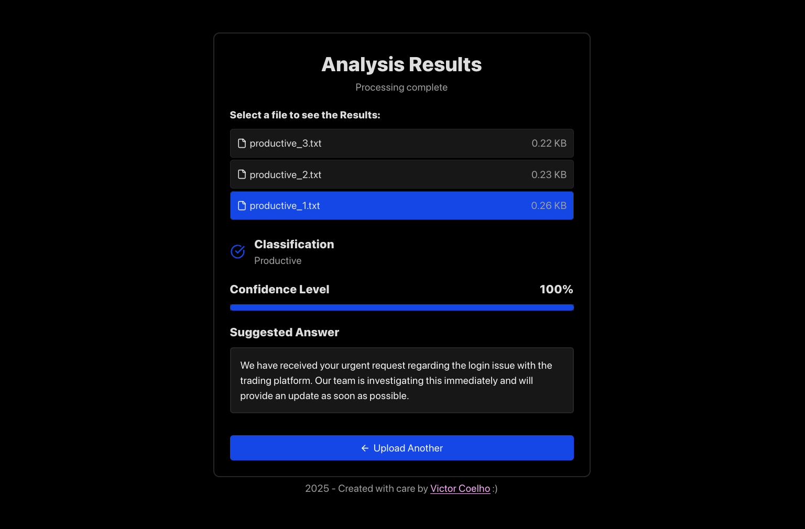

# Email Classifier - Frontend Client



A web app built with Vite, TypeScript and React for classifying e-mails as productive or unproductive.
The frontend connects to a Python backend integrated with the OpenAI API, for the actual classification
step.

### Features

- Classifies e-mails as productive or unproductive
- Provides a confidence level for each classification
- Also provides a suggested answer for a given e-mail
- Supports file uploads (.txt or .pdf) or manual input via textbox
- Lightweight, minimal and built with modern tooling

### Installation

This project uses pnpm for package management. If you don't have it installed already, you
can install pnpm (here)[https://pnpm.io/installation]

1. Clone the repository and navigate into the project folder:
```sh
git clone https://github.com/victorcoelh/email-classifier-web.git
cd email-classifer-web
```

2. Install dependencies with:
```pnpm install```

3. (Optional) Build the project for production:
```pnpm run build```

Building is not required to run the project locally.

### Environment Variables

Before running the project, you'll need to provide two environment variables:
- The backend server's URL (```VITE_API_URL```)
- The backend server's static API Key (```VITE_API_KEY```) -> this is done as a simple authentication step to prevent unwated access to backend resources.

This is achievable by creating a .env file in the project's root, with the following commands:

```sh
export VITE_API_URL={your_backend_url}
export VITE_API_KEY={your_backend_api_key}
```

### Usage

Run the app in development mode (hot-reloading enabled):

```pnpm run dev```

The app will be available at http://localhost:5173 by default.

If you built the project using ```pnpm run build```, you can preview it locally using:

```pnpm run preview```

And the app will instead be available at http://localhost:4173.
